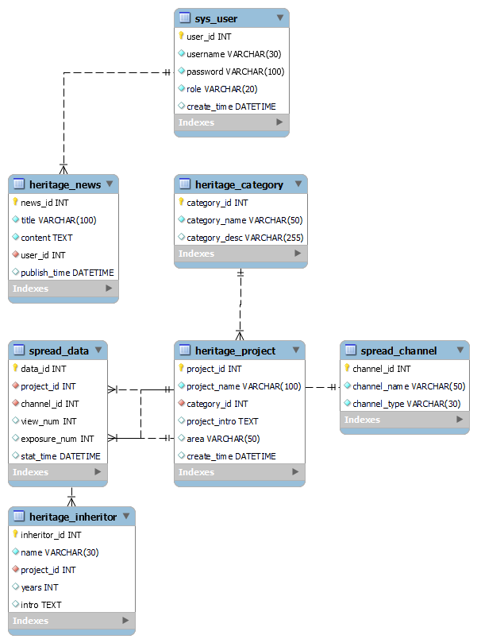

# 非遗文化数字化传播系统

> **数据库原理与传播应用实验 · 课程项目**
>
> 基于 MySQL + Spring Boot + 纯前端技术栈构建的非遗文化数字化传播管理系统，实现对非遗资源、传承人、文化资讯、传播渠道及传播数据的全流程数字化管理。

---

## 📋 目录

- [系统概述](#-系统概述)
- [功能架构](#-功能架构)
- [技术栈](#-技术栈)
- [系统架构](#-系统架构)
- [数据库设计](#-数据库设计)
- [API 接口概览](#-api-接口概览)
- [目录结构](#-目录结构)
- [快速开始](#-快速开始)
- [小组分工](#-小组分工)
- [详细模块说明](#-详细模块说明)
- [常见问题](#-常见问题)
- [演示账号](#-演示账号)

---

## 🏛 系统概述

本系统以非物质文化遗产的数字化传播为核心目标，围绕"资源管理 → 内容生产 → 渠道投放 → 数据反馈"的业务闭环设计，涵盖以下核心能力：

| 模块 | 功能简述 |
|------|----------|
| **非遗分类管理** | 对非遗项目进行顶层分类（传统技艺、传统戏剧等），支持增删改查 |
| **非遗项目管理** | 管理非遗项目的详细信息、分类归属、传承人关联 |
| **传承人管理** | 记录非遗传承人的基本信息、从业年限、关联项目 |
| **文化资讯管理** | 发布、审核、展示非遗相关的文化文章与动态 |
| **传播渠道管理** | 管理各类线上/线下传播投放渠道 |
| **传播数据统计** | 录入并可视化展示各渠道、各项目的浏览量/曝光量数据 |
| **用户认证与权限** | 支持多角色（管理员/编辑/普通用户）的 JWT 登录认证 |

---

## 🧩 功能架构

```
非遗文化数字化传播系统
│
├── 首页（登录/注册）
│   ├── 英雄区轮播图（5 张非遗主题幻灯片）
│   ├── 用户登录（JWT 认证）
│   └── 用户注册
│
├── 管理后台
│   ├── 基础数据展示
│   │   ├── 非遗分类（列表 / 新增 / 编辑 / 删除）
│   │   ├── 非遗项目（列表 / 筛选 / 详情 / 新增 / 编辑 / 删除）
│   │   └── 传承人（列表 / 筛选 / 详情 / 新增 / 编辑 / 删除）
│   │
│   ├── 文化资讯
│   │   ├── 资讯列表（分页展示）
│   │   ├── 资讯详情（正文 + 评论互动）
│   │   └── 发布/编辑资讯
│   │
│   ├── 传播渠道管理
│   │   └── 渠道列表 / 新增 / 编辑 / 删除
│   │
│   └── 数据统计分析
│       ├── 汇总卡片（总浏览量、总曝光量、渠道数、项目数）
│       ├── 各渠道浏览/曝光对比柱状图
│       ├── 各项目浏览/曝光对比柱状图
│       ├── 渠道浏览量分布饼图
│       ├── 项目曝光量排行水平条形图
│       └── 传播数据综合分析组合图
│
└── 数据统计独立页（data/index.html）
    └── 同管理后台统计模块，独立展示
```

---

## 🛠 技术栈

| 层级 | 技术 | 版本 |
|------|------|------|
| **数据库** | MySQL | 8.0+ |
| **后端** | Java Spring Boot | 3.3.12 |
| | MyBatis-Plus | 3.5.7 |
| | JWT (java-jwt) | 4.5.0 |
| | Spring Security Crypto (BCrypt) | — |
| | Spring Data Redis | — |
| | Knife4j (API 文档) | 4.5.0 |
| | Lombok | — |
| **前端** | HTML5 + CSS3 + JavaScript (ES6) | — |
| | ECharts | 5.5.0 |
| **API 代理** | Python Flask | 3.0+ |
| **构建工具** | Maven | 3.6+ |
| **运行环境** | JDK 17+, Python 3.8+, Node.js (可选) | — |

---

## 📐 系统架构

```
┌─────────────────────────────────────────────────────────┐
│                      浏览器                              │
│              http://localhost:8080                       │
└────────────────────────┬────────────────────────────────┘
                         │
                         ▼
┌─────────────────────────────────────────────────────────┐
│              Flask 前端服务 (端口 8080)                    │
│                                                          │
│    ┌───────────────────┐    ┌─────────────────────┐      │
│    │  静态文件服务       │    │   API 反向代理        │      │
│    │  /frontend/*      │    │  /api/* → :8081/*   │      │
│    │  /data/*          │    └──────────┬──────────┘      │
│    └───────────────────┘               │                 │
└─────────────────────────────────────────┼────────────────┘
                                          │
                                          ▼
┌─────────────────────────────────────────────────────────┐
│           Java Spring Boot 后端 (端口 8081)               │
│                                                          │
│   ┌──────────────┐  ┌──────────────┐  ┌──────────────┐  │
│   │ Controller   │→ │ ServiceImpl  │→ │   Mapper     │  │
│   │ 层 (REST)    │  │ 层 (业务逻辑)  │  │ 层 (MyBatis) │  │
│   └──────────────┘  └──────────────┘  └──────┬───────┘  │
│                                              │          │
└──────────────────────────────────────────────┼──────────┘
                                               │
                                               ▼
┌─────────────────────────────────────────────────────────┐
│              MySQL 数据库 (端口 3306)                      │
│              heritage_spread_db                          │
│                                                          │
│   8 张表 + 1 个视图 + 2 个触发器                         │
└─────────────────────────────────────────────────────────┘
```

### 请求流转示例

以"获取非遗项目列表"为例：

```
浏览器 GET /api/projects?page=1&size=10
  → Flask 接收请求，识别 /api/ 前缀
  → 转发至 http://localhost:8081/api/projects?page=1&size=10
  → Spring Boot ProjectController 处理
  → ProjectService 调用 ProjectMapper
  → MyBatis 执行 SQL 查询 MySQL
  → JSON 响应逐层返回至浏览器
```

---

## 💾 数据库设计

### E-R 关系



### 表结构总览（8 张表）

| # | 表名 | 说明 | 核心字段 |
|---|------|------|----------|
| 1 | `sys_user` | 系统用户表 | user_id, username, password(BCrypt), role, status |
| 2 | `heritage_category` | 非遗分类表 | category_id, category_name(唯一), category_desc |
| 3 | `heritage_project` | 非遗项目表 | project_id, project_name, category_id(FK), area, status |
| 4 | `heritage_inheritor` | 非遗传承人表 | inheritor_id, name, project_id(FK), years, intro |
| 5 | `heritage_news` | 文化资讯表 | news_id, title, content, user_id(FK), status(ENUM) |
| 6 | `spread_channel` | 传播渠道表 | channel_id, channel_name, channel_type, status |
| 7 | `spread_data` | 传播数据统计表 | data_id, project_id(FK), channel_id(FK), view_num, exposure_num |
| 8 | `news_comment` | 资讯评论表 | comment_id, news_id(FK), user_id(FK), content, status |

### 视图

| 视图名 | 说明 |
|--------|------|
| `v_project_spread_stats` | 按项目汇总传播渠道数、总浏览量、总曝光量 |

### 触发器

| 触发器名 | 触发时机 | 功能 |
|----------|----------|------|
| `trg_spread_data_check_time` | INSERT | 校验 stat_time 不能晚于当前时间 |
| `trg_spread_data_check_time_update` | UPDATE | 校验 stat_time 不能晚于当前时间 |

### 外键级联策略

| 外键 | 级联策略 | 设计意图 |
|------|----------|----------|
| 项目 → 分类 | RESTRICT | 禁止删除有项目的分类 |
| 传承人 → 项目 | RESTRICT | 禁止删除有传承人的项目 |
| 资讯 → 用户 | RESTRICT | 禁止删除有资讯的用户 |
| 传播数据 → 项目 | CASCADE | 删除项目时自动清除统计数据 |
| 传播数据 → 渠道 | CASCADE | 删除渠道时自动清除统计数据 |
| 评论 → 资讯 | CASCADE | 删除资讯时自动清除评论 |
| 评论 → 用户 | CASCADE | 删除用户时自动清除评论 |

> 核心业务实体使用 RESTRICT（防止误删），附属数据使用 CASCADE（随主实体自动清理）。

---

## 🌐 API 接口概览

所有接口基础路径：`http://localhost:8080/api`

### 认证模块

| 方法 | 路径 | 权限 | 说明 |
|------|------|------|------|
| POST | `/api/auth/login` | 公开 | 用户登录，返回 JWT Token |
| POST | `/api/auth/register` | 公开 | 用户注册 |
| GET | `/api/auth/me` | 登录用户 | 获取当前用户信息 |

### 非遗分类

| 方法 | 路径 | 权限 | 说明 |
|------|------|------|------|
| GET | `/api/categories` | 公开 | 获取全部分类 |
| POST | `/api/categories` | admin | 新增分类 |
| PUT | `/api/categories/{id}` | admin | 编辑分类 |
| DELETE | `/api/categories/{id}` | admin | 删除分类 |

### 非遗项目

| 方法 | 路径 | 权限 | 说明 |
|------|------|------|------|
| GET | `/api/projects` | 公开 | 获取项目列表（支持分页、分类筛选、关键词搜索） |
| GET | `/api/projects/{id}` | 公开 | 获取项目详情（含传承人列表） |
| POST | `/api/projects` | admin/editor | 新增项目 |
| PUT | `/api/projects/{id}` | admin/editor | 编辑项目 |
| DELETE | `/api/projects/{id}` | admin | 删除/下架项目 |

### 传承人

| 方法 | 路径 | 权限 | 说明 |
|------|------|------|------|
| GET | `/api/inheritors` | 公开 | 获取传承人列表（支持分页、项目筛选） |
| GET | `/api/inheritors/{id}` | 公开 | 获取传承人详情 |
| POST | `/api/inheritors` | admin/editor | 新增传承人 |
| PUT | `/api/inheritors/{id}` | admin/editor | 编辑传承人 |
| DELETE | `/api/inheritors/{id}` | admin | 删除传承人 |

### 文化资讯

| 方法 | 路径 | 权限 | 说明 |
|------|------|------|------|
| GET | `/api/news` | 公开 | 获取资讯列表（分页） |
| GET | `/api/news/{id}` | 公开 | 获取资讯详情（含评论） |
| POST | `/api/news` | admin/editor | 发布资讯 |
| PUT | `/api/news/{id}` | admin/editor | 编辑资讯 |
| DELETE | `/api/news/{id}` | admin/editor | 删除资讯 |
| POST | `/api/news/{id}/comments` | 登录用户 | 发表评论 |

### 传播渠道

| 方法 | 路径 | 权限 | 说明 |
|------|------|------|------|
| GET | `/api/channels` | 公开 | 获取渠道列表 |
| POST | `/api/channels` | admin | 新增渠道 |
| PUT | `/api/channels/{id}` | admin | 编辑渠道 |
| DELETE | `/api/channels/{id}` | admin | 删除渠道 |

### 传播数据统计

| 方法 | 路径 | 权限 | 说明 |
|------|------|------|------|
| GET | `/api/stats/channel` | 公开 | 各渠道浏览量/曝光量汇总 |
| GET | `/api/stats/project` | 公开 | 各项目传播数据分页记录 |
| GET | `/api/stats/project/{id}` | 公开 | 单个项目传播热度统计 |
| GET | `/api/stats/project/{id}/trend` | 公开 | 项目传播趋势数据 |
| POST | `/api/stats/record` | admin | 手动录入传播数据 |

### 搜索

| 方法 | 路径 | 权限 | 说明 |
|------|------|------|------|
| GET | `/api/search?keyword=xxx` | 公开 | 全局搜索（项目名、地区、传承人模糊匹配） |

> 完整接口文档详见 [`docs/接口文档.md`](docs/接口文档.md)

---

## 📁 目录结构

```
Heritage_spread-link/
│
├── app.py                          # Flask 前端服务 + API 反向代理
├── requirements.txt                # Python 依赖（Flask, requests, flask-cors）
├── README.md                       # 本文档
│
├── database/                       # 数据库脚本（成员A）
│   ├── README.md
│   └── heritagespread_db.sql       # 建库建表 + 5 个版本迭代 + 样例数据
│
├── backend/                        # Java Spring Boot 后端（成员B）
│   ├── pom.xml                     # Maven 依赖配置
│   ├── README.md
│   └── src/main/java/org/example/heritage/
│       ├── HeritageApplication.java   # 启动入口 @MapperScan
│       ├── config/                    # JWT、Knife4j、WebMVC 配置
│       ├── controller/                # REST 控制器层
│       │   ├── AuthController.java
│       │   ├── CategoryController.java
│       │   ├── ProjectController.java
│       │   ├── InheritorController.java
│       │   ├── NewsController.java
│       │   ├── ChannelController.java
│       │   ├── StatsController.java
│       │   └── SearchController.java
│       ├── service/                   # 业务逻辑层
│       ├── mapper/                    # MyBatis Mapper 接口
│       ├── pojo/                      # 实体、DTO、VO
│       ├── common/                    # 通用工具（JWT、异常、拦截器、常量）
│       └── resources/
│           ├── application.yml        # Spring Boot 配置
│           └── mapper/                # MyBatis XML 映射文件
│
├── frontend/                       # 前端页面（成员C）
│   ├── index.html                  # 管理后台 SPA
│   ├── login.html                  # 首页：登录/注册 + 英雄区轮播
│   ├── server.js                   # Node.js 开发服务器（可选）
│   ├── README.md
│   ├── css/
│   │   └── style.css               # 水墨丹青主题样式表（2200+ 行）
│   ├── js/
│   │   ├── app.js                  # 管理后台逻辑 + API 调用
│   │   ├── landing.js              # 首页轮播 + 登录/注册交互
│   │   └── echarts.min.js          # ECharts 图表库
│   └── images/                     # 非遗主题图片
│       ├── china.png               # 景德镇手工制瓷技艺
│       ├── wall_paint.png          # 敦煌莫高窟
│       ├── kunqu.png               # 昆曲
│       ├── cutting.png             # 中国剪纸
│       └── gesaer.jpeg             # 格萨尔王
│
├── data/                           # 统计图表模块（成员D）
│   ├── index.html                  # 独立统计展示页
│   ├── README.md
│   └── js/stats.js                 # ECharts 图表渲染（渠道/项目/综合分析）
│
└── docs/                           # 文档资料
    ├── ER图.png                    # 数据库 E-R 关系图
    ├── ER_图.png
    └── 接口文档.md                  # 后端 REST API 详细文档
```

---

## 🚀 快速开始

### 前置条件

- Python 3.8+（已安装 pip）
- Java JDK 17+
- MySQL 8.0（已启动）
- Maven 3.6+

### 1. 安装 Python 依赖

```bash
pip install -r requirements.txt
```

### 2. 初始化数据库

在 MySQL 中执行数据库初始化脚本：

```bash
mysql -u root -p < database/heritagespread_db.sql
```

该脚本会创建 `heritage_spread_db` 数据库及其全部 8 张表、1 个视图、2 个触发器，并插入演示数据。

### 3. 修改数据库连接配置

编辑 `backend/src/main/resources/application.yml`，修改 MySQL 用户名和密码：

```yaml
spring:
  datasource:
    username: root          # 改成你的 MySQL 用户名
    password: your_password # 改成你的 MySQL 密码
```

### 4. 启动 Java 后端

```bash
cd backend
mvn spring-boot:run
```

后端启动后默认监听 **8081 端口**。访问 `http://localhost:8081` 看到 Spring Boot 日志即表示成功。

### 5. 启动 Flask 前端服务

```bash
# 在项目根目录
python app.py
```

启动后输出：

```
==============================================================
  非遗文化数字化传播系统 - 前端服务
  静态文件: http://localhost:8080
  API 代理: /api/* → http://localhost:8081/api/*
==============================================================
```

### 6. 访问系统

浏览器打开 **http://localhost:8080**

| 页面 | 访问地址 | 说明 |
|------|----------|------|
| 首页 | `http://localhost:8080/` | 轮播展示 + 登录/注册 |
| 管理后台 | 登录后自动跳转 | 非遗分类、项目、传承人、资讯、渠道、统计 |
| 独立统计页 | `http://localhost:8080/data/index.html` | 纯数据可视化展示 |

### 启动顺序

```
MySQL → Java Spring Boot (端口 8081) → Flask (端口 8080)
```

---

## 👥 小组分工

| 成员 | 负责模块 | 对应目录 |
|------|----------|----------|
| **成员A（组长）** | 数据库设计、SQL 脚本编写与迭代、项目统筹 | `database/` |
| **成员B** | 后端接口开发（Java Spring Boot）、API 定义与实现 | `backend/` |
| **成员C** | 前端页面开发（HTML/CSS/JS）、管理后台 SPA | `frontend/` |
| **成员D** | 传播数据统计模块、ECharts 图表可视化 | `data/` |
| **成员E** | 系统测试、样例数据维护、演讲 PPT | 全局 |

---

## 📦 详细模块说明

### 前端 — 水墨丹青主题

前端采用中国风"水墨丹青"设计语言：

- **色彩体系**：朱砂红 (`#C41E3A`)、金 (`#DAA520`)、墨色 (`#2C1810`)、宣纸白 (`#F5F0E8`)
- **字体**：`Noto Serif SC`（宋体）、`ZCOOL XiaoWei`（书法体）、`Ma Shan Zheng`（行书）
- **视觉元素**：印章标识、云纹装饰、回纹边框、渐变阴影、宣纸纹理背景
- **交互反馈**：按钮按压缩放、卡片悬浮上浮、页面切换动画、滚动监听导航

### 前端 — 英雄区轮播

首页顶部为全屏轮播组件，5 张幻灯片展示代表性非遗项目：

| 幻灯片 | 非遗项目 | 对应的本地图片 |
|--------|----------|---------------|
| 1 | 景德镇手工制瓷技艺 | `china.png` |
| 2 | 敦煌莫高窟壁画 | `wall_paint.png` |
| 3 | 昆曲 | `kunqu.png` |
| 4 | 中国剪纸 | `cutting.png` |
| 5 | 格萨尔王史诗 | `gesaer.jpeg` |

轮播支持自动播放、原点指示器切换、淡入淡出过渡动画。

### 前端 — 管理后台 SPA

基于原生 JavaScript 实现的单页应用（SPA），路由由 `showPage()` 函数管理。所有 API 请求通过统一的 `API` 对象封装，自动附加 JWT Token。

**权限控制**：
- `admin`：全部操作权限（增删改查）
- `editor`：项目管理、资讯发布、传承人管理（无渠道管理和用户管理）
- `user`：仅浏览查看

### 后端 — API 设计

采用 RESTful 风格设计，统一响应格式：

```json
{
  "code": 200,
  "msg": "success",
  "data": {}
}
```

认证方式为 **JWT Bearer Token**（7 天有效期），密码使用 **BCrypt** 加密存储。

### 后端 — 三层架构

```
Controller（接收请求、参数校验）
    ↓
Service（业务逻辑、事务管理）
    ↓
Mapper（MyBatis-Plus 数据访问）
```

### 数据库 — 设计迭代

数据库脚本经历了 **v1.0 → v1.1 → v1.2 → v1.3** 四个版本的持续优化，每次迭代解决实际开发中发现的问题：

- **v1.1**：修复外键缺失、AUTO_INCREMENT 偏移、类型不匹配等严重问题
- **v1.2**：修正规范地名、统一状态字段类型、补充 ENUM 值
- **v1.3**：新增视图和触发器、优化索引策略、补充数据完整性自检

### 数据统计 — ECharts 可视化

使用 ECharts 5.5 实现 5 种图表：

| 图表 | 位置 | 类型 |
|------|------|------|
| 各渠道浏览/曝光对比 | 管理后台 & 独立统计页 | 柱状图 |
| 各项目浏览/曝光对比 | 管理后台 & 独立统计页 | 柱状图 |
| 渠道浏览量分布 | 管理后台 & 独立统计页 | 饼图 |
| 项目曝光量排行 | 管理后台 & 独立统计页 | 水平条形图 |
| 传播数据综合分析 | 管理后台 & 独立统计页 | 组合图（柱状+折线） |

---

## ❓ 常见问题

### Java 后端端口冲突

Flask 占用 **8080** 端口，Java 后端必须配置为 **8081**。如果启动 Java 后端时提示端口被占用，检查 `application.yml` 中的 `server.port` 配置。

### API 请求返回 503

```
{"code": 503, "msg": "后端服务未启动（http://localhost:8081）..."}
```

表示 Java Spring Boot 后端未启动。请先启动 Java 后端，再启动 Flask 服务。

### 数据库连接失败

检查 `application.yml` 中的数据库配置：
- MySQL 服务是否已启动
- 用户名和密码是否正确
- 数据库 `heritage_spread_db` 是否已创建

### 前端页面空白

- 检查浏览器控制台是否有 JS 错误
- 确保 Flask 服务已正确启动
- 确保登录后已获取 Token

---

## 👤 演示账号

| 用户名 | 密码 | 角色 | 权限范围 |
|--------|------|------|----------|
| `admin` | `bingo...333` | 管理员 | 全部功能 |
| `editor1` | `123456` | 编辑 | 项目管理、资讯发布、传承人管理 |
| `user1` | `bingo...333` | 普通用户 | 仅浏览查看 |

---

## 📝 补充说明

- **启动顺序**：MySQL → Java 后端 → Flask 前端
- **前端代码无需修改**，所有 API 请求为相对路径 `/api/...`，Flask 自动转发到 Java 后端
- 前端也可通过 `node frontend/server.js` 启动 Node.js 开发服务器（端口 3000）
- 完整 API 文档参见 [`docs/接口文档.md`](docs/接口文档.md)，包含全部接口的请求/响应示例及权限说明
- 接口文档也可通过 Knife4j 在线查看：`http://localhost:8081/doc.html`

---

> **非物质文化遗产是民族文化的瑰宝，数字化传播为其保护与传承提供了新的可能。**
